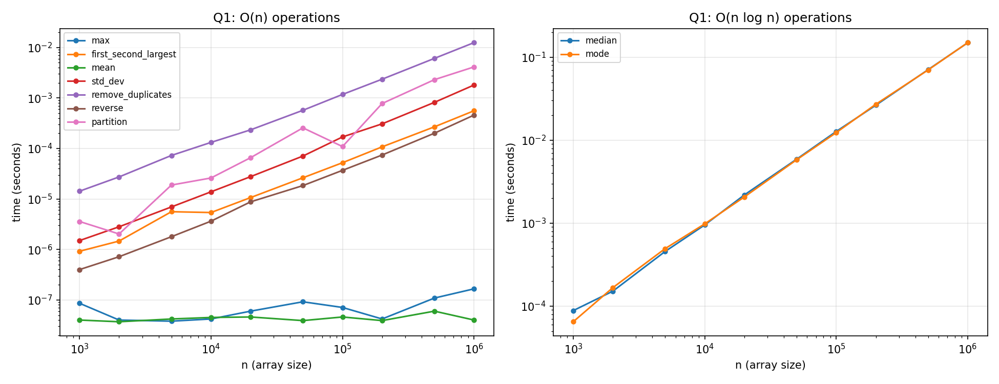

# Q1: 1D Array Operations and their Complexities

## Problem
Given an unsorted array of `n` integers, determine the worst-case time
complexity of several common operations, implement them in C, and validate
the complexity experimentally.

## Input Representation
A plain contiguous `int arr[n]` — the most cache-friendly layout, giving O(1)
random access which several of the routines below rely on.

## Complexity Table

| # | Operation | Worst-case complexity | Approach |
|---|---|---|---|
| (i) | Maximum element | **O(n)** | single linear scan |
| (ii) | First & second largest | **O(n)** | one pass, track two running maxima |
| (iii) | Mean | **O(n)** | sum all elements, divide by n |
| (iv) | Median | **O(n log n)** | sort, then read the middle element(s) |
| (v) | Standard deviation | **O(n)** | one pass for the mean, one pass for Σ(x−μ)² |
| (vi) | Mode | **O(n log n)** | sort, then scan for the longest run of equal values |
| (vii) | Remove duplicates | **O(n) average** | hash set to detect "seen before" |
| (viii) | Reverse the array | **O(n)** | two-pointer swap from both ends |
| (ix) | Partition around random pivot (≥pivot block placed *before* <pivot block) | **O(n)** | single Lomuto-style pass, comparison reversed |

**Lower bound reasoning:** any operation that must examine every element to
guarantee correctness (max, mean, std-dev, reverse, partition) needs Ω(n)
time — matching the O(n) upper bound exactly. Median and mode, solved via
comparison-based sorting, inherit the Ω(n log n) comparison-sort lower bound
(this can be beaten with non-comparison techniques like median-of-medians
selection or counting sort, which are out of scope here).

## Files
- `q1_array_ops.c` — implementation of all 9 operations plus a `--csv` mode
- `q1_results.csv` — timing data for each operation at array sizes from
  1,000 to 1,000,000
- `q1_graph.png` — log-log plot of time vs. n, separated into the O(n) group
  and the O(n log n) group

## How to Reproduce
```bash
gcc -O2 -o q1 q1_array_ops.c -lm
./q1                 # human-readable validation run
./q1 --csv > q1_results.csv   # generates the CSV used for the graph
python3 plot_q1.py   # regenerates q1_graph.png from the CSV (see repo root)
```

## Result / Interpretation


On the log-log plot, the O(n) operations (max, first/second largest, mean,
std-dev, remove-duplicates, reverse, partition) all show roughly a slope of
1, meaning time scales linearly with n — doubling n roughly doubles the
time. The O(n log n) operations (median, mode) show a very similar but
slightly steeper trend once n grows large, reflecting the extra log(n)
factor from sorting. Both groups match their theoretically derived bounds.
