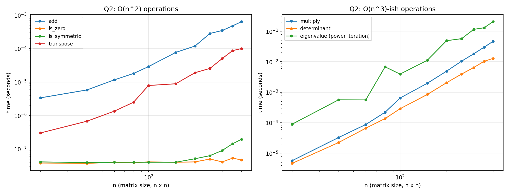

# Q2: 2D Square Matrix Operations and their Complexities

## Problem
Given `n x n` square matrices, determine the worst-case computational
complexity of common matrix algorithms, implement them in C, and validate
the complexity experimentally.

## Input Representation
A single contiguous `double M[n*n]` array accessed in row-major order via
`M[i*n+j]`. This avoids the pointer-chasing overhead of an array-of-pointers
2D representation and makes an in-place transpose trivial (O(1) extra space).

## Complexity Table

| # | Operation | Worst-case complexity | Notes |
|---|---|---|---|
| (i) | Matrix addition | **O(n²)** | one pass over all n² entries |
| (ii) | Matrix multiplication | **O(n³)** (naive) | Strassen's algorithm achieves O(n^2.81); not implemented here |
| (iii) | Zero-matrix test | **O(n²)** | scan all n² entries |
| (iv) | Symmetric-matrix test | **O(n²)** | compare M[i][j] with M[j][i] for every i<j |
| (v) | Determinant | **O(n³)** | Gaussian elimination with partial pivoting; naive cofactor expansion is O(n!) |
| (vi) | Transpose in place | **O(n²)**, O(1) extra space | swap M[i][j] ↔ M[j][i] for i<j |
| (vii) | Eigenvalue / eigenvector | **O(k·n²)** per dominant pair (power iteration, k = #iterations to converge) | For n≥5 there is **no closed-form solution** (Abel–Ruffini theorem — eigenvalues are roots of the degree-n characteristic polynomial). All practical methods are iterative; the general QR algorithm costs O(n³) per iteration to find *all* eigenvalues. |

## Files
- `q2_matrix_ops.c` — implementation of all 7 operations plus a `--csv` mode
- `q2_results.csv` — timing data at matrix sizes from 20×20 to 400×400
- `q2_graph.png` — log-log plots comparing O(n²) vs O(n³)-family operations

## How to Reproduce
```bash
gcc -O2 -o q2 q2_matrix_ops.c -lm
./q2                 # human-readable validation run
./q2 --csv > q2_results.csv
python3 plot_q2.py   # regenerates q2_graph.png (see repo root)
```

## Result / Interpretation


The left panel (addition, zero-test, symmetric-test, transpose) shows curves
consistent with O(n²) growth — doubling n roughly quadruples the time. The
right panel (multiply, determinant, power-iteration eigenvalue) grows
noticeably faster, consistent with the O(n³)-type bounds — doubling n
roughly multiplies time by ~8. The eigenvalue curve is slightly noisier
because the number of power-iteration rounds needed to converge depends on
the matrix's eigenvalue gap, which varies with the random matrix generated
at each size.
