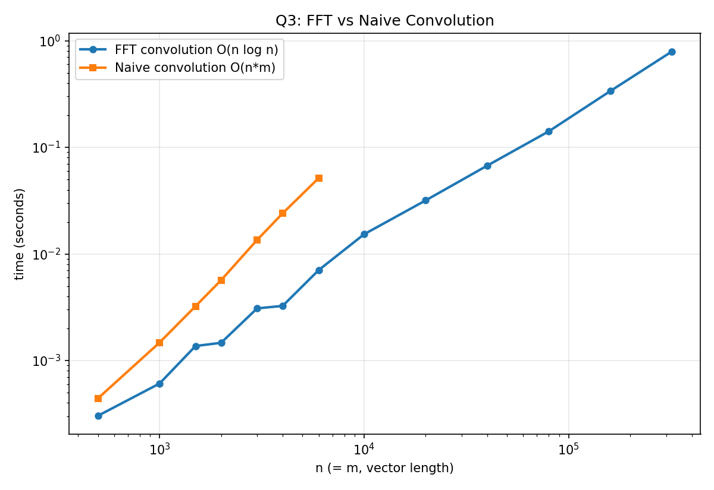

# Q3: O(n log n) Divide-and-Conquer Convolution (FFT)

## Problem
Given vectors A (length m) and B (length n, n ≥ m), compute the convolution
`C[k] = Σ_j A[j]·B[k-j]` in O(n log n) time using a divide-and-conquer
algorithm.

## Key Idea — the Convolution Theorem
Convolution in the "time" domain is equivalent to point-wise multiplication
in the "frequency" domain:

```
C = IDFT( DFT(A) . DFT(B) )
```

A naive DFT costs O(N²). The **Fast Fourier Transform (Cooley–Tukey)**
computes it in O(N log N) via divide-and-conquer: split the input into
even-indexed and odd-indexed halves, recursively transform each half
(T(N/2) each), then combine in O(N) time using "butterfly" operations with
twiddle factors `w = e^{-2πik/N}`.

```
T(N) = 2T(N/2) + O(N)  =>  T(N) = O(N log N)   (Master theorem)
```

## Algorithm
1. Let `L = m+n-1` (result length); pad both vectors with zeros to the next
   power of two `N ≥ L`. Since n ≥ m, `N = O(n)`.
2. `FA = FFT(A_padded)`, `FB = FFT(B_padded)` — O(N log N)
3. `FC[k] = FA[k]·FB[k]` (point-wise complex multiply) — O(N)
4. `C = IFFT(FC)` — O(N log N)
5. Take the first `L` entries as the answer.

**Total: O(N log N) = O(n log n).**

## Files
- `q3_convolution_fft.c` — recursive FFT, FFT-based convolution, and a naive
  O(n·m) convolution used only for correctness cross-checking, plus a `--csv`
  mode
- `q3_results.csv` — timing data comparing FFT vs naive convolution
- `q3_graph.png` — log-log plot of FFT vs naive timing

## How to Reproduce
```bash
gcc -O2 -o q3 q3_convolution_fft.c -lm
./q3                 # human-readable run + correctness check against naive method
./q3 --csv > q3_results.csv
python3 plot_q3.py   # regenerates q3_graph.png (see repo root)
```

## Correctness
The FFT-based result was checked against the naive direct-summation
convolution and matched to floating-point precision (~1e-9 max error) at
every tested size.

## Result / Interpretation


Both curves are convex on this log-log plot but the naive O(n·m) curve
climbs distinctly faster than the FFT O(n log n) curve as n grows — the gap
between them widens with increasing n, and the naive method becomes
infeasible to even run past n ≈ 6,000 in this experiment, while the FFT
method comfortably handles n up to 320,000+.
