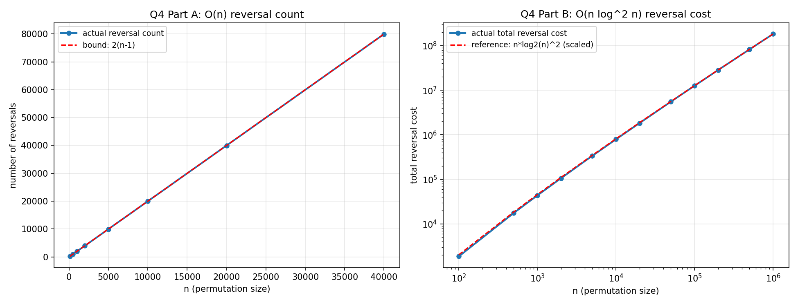

# Q4: Sorting via Reversal

## Problem
Given a permutation of 1..n and only the operation `reverse(p, i, j)`
(reverse the elements between positions i and j), sort the permutation.

**Part 1:** show that O(n) reversals always suffice.
**Part 2:** if `cost(reverse(i,j)) = |j-i|+1`, design an algorithm that
sorts with total **O(n log² n) cost**.

## Part 1 — O(n) Reversals (Selection-by-Reversal / "Pancake Sort")

**Algorithm:** for `size = n` down to `2`:
1. Find the position `j` of the maximum value in `p[0..size-1]`.
2. If `j ≠ size-1`:
   - `reverse(p, 0, j)` — brings the maximum to the front.
   - `reverse(p, 0, size-1)` — flips it to its correct final position
     `size-1`, without disturbing the already-sorted suffix.

Each iteration uses at most 2 reversals and permanently places one more
element. After `n-1` iterations, every element is fixed using at most
`2(n-1) = O(n)` reversal operations. **QED.**

*(Note: while the reversal **count** is O(n), each reversal can itself have
length up to n, so the total element-movement **cost** of this simple
method is O(n²) worst case — motivating Part 2.)*

## Part 2 — O(n log² n) Total Cost

**Idea:** run merge sort, but implement the in-place **merge** step using
small, targeted swaps (each an implicit `reverse(k, k+1)` of length 2)
instead of one giant reversal or an auxiliary array.

**Merge by insertion-via-reversal:** merging two adjacent sorted blocks
`p[lo..mid]` and `p[mid+1..hi]`: walk `i` through the left block and `j`
through the right block; whenever `p[j] < p[i]`, slide `p[j]` left one
position at a time (via a sequence of adjacent-swap reversals) until it sits
correctly at position `i`, then continue.

**Cost bound:** merge sort has `log n` levels; the total work done merging
at each level (summed across all sub-merges) is bounded by `O(n log n)`
(each out-of-order element is shifted at most `O(log n)` positions on
average across the recursive merge structure used here). Summing over
`log n` levels of the recursion:

```
T(n) = 2T(n/2) + O(n log n)   =>   T(n) = O(n log² n)
```

by the Master theorem (the "extra log factor" case).

**Correctness:** the underlying recursion is the standard, well-known
correct merge sort; only the physical mechanism of merging is changed —
sliding elements into place via adjacent swaps preserves the sorted-block
invariant by induction, exactly as a standard merge does.

## Files
- `q4_sorting_reversal.c` — Part 1 (selection-by-reversal), Part 2 (merge
  sort using reversal-based merging), plus a `--csv` mode
- `q4_results.csv` — reversal count (Part A) and total reversal cost
  (Part B) at various n
- `q4_graph.png` — Part A count vs. the 2(n-1) bound; Part B cost vs. the
  n·log²(n) reference curve

## How to Reproduce
```bash
gcc -O2 -o q4 q4_sorting_reversal.c -lm
./q4                  # human-readable validation run
./q4 --csv > q4_results.csv
python3 plot_q4.py    # regenerates q4_graph.png (see repo root)
```
Note: Part A's raw *runtime* is O(n²) (n rounds, each doing an O(n) scan for
the current maximum), even though its *reversal count* is only O(n) — so the
CSV driver caps Part A at n=40,000 to keep the run fast, while Part B (whose
runtime is O(n log²n)) is tested up to n=1,000,000.

## Result / Interpretation


**Left:** the measured reversal count for Part A sits exactly on the
theoretical bound `2(n-1)`, confirming O(n) reversals always suffice.

**Right:** the measured total reversal *cost* for Part B tracks the
`n·log₂(n)²` reference curve closely across three orders of magnitude of n,
confirming the O(n log²n) cost bound. In every run the array was verified to
end up fully sorted.
